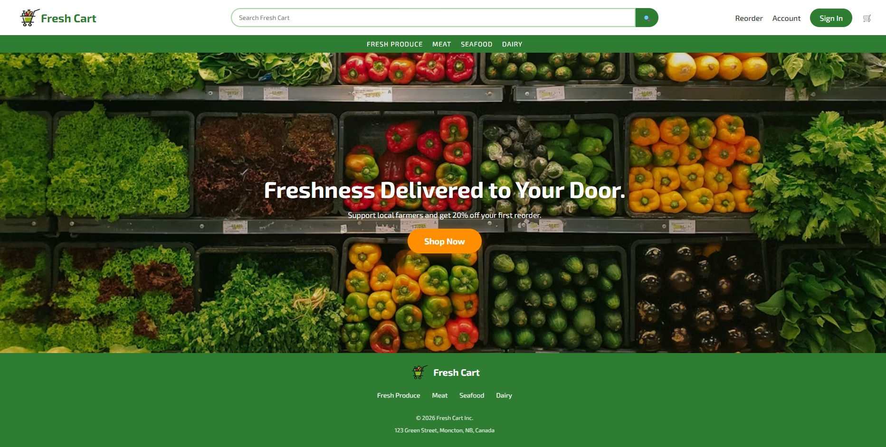
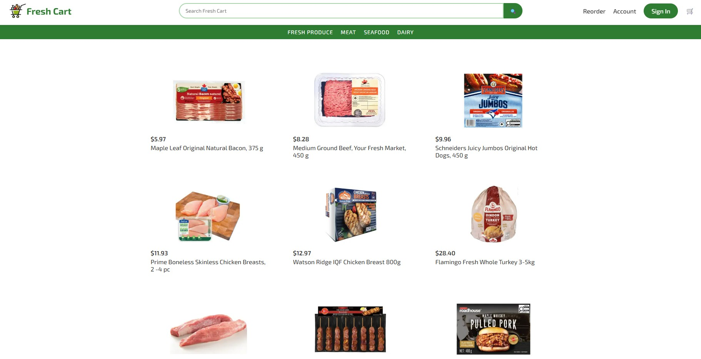
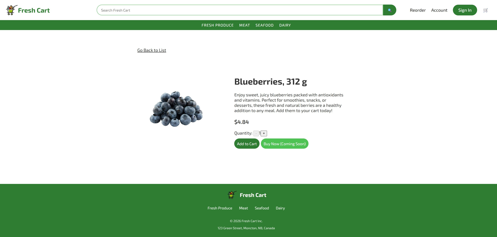
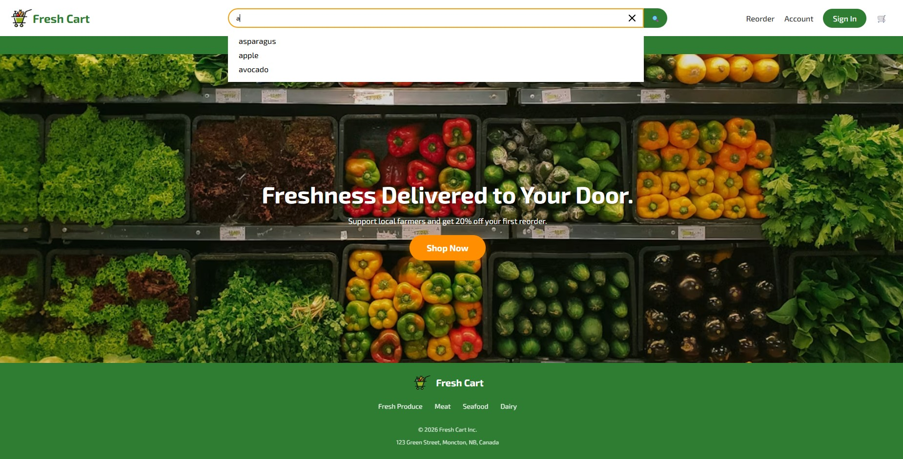
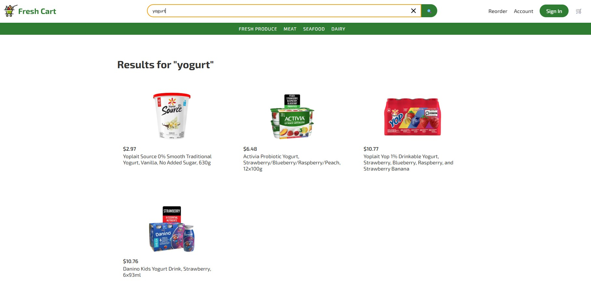
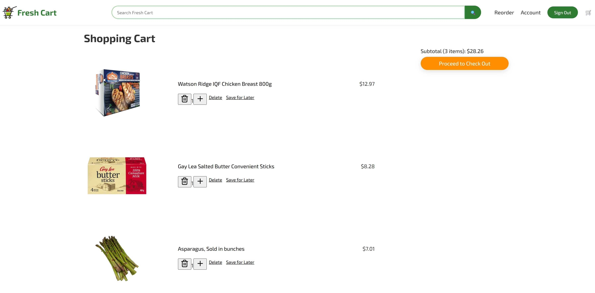
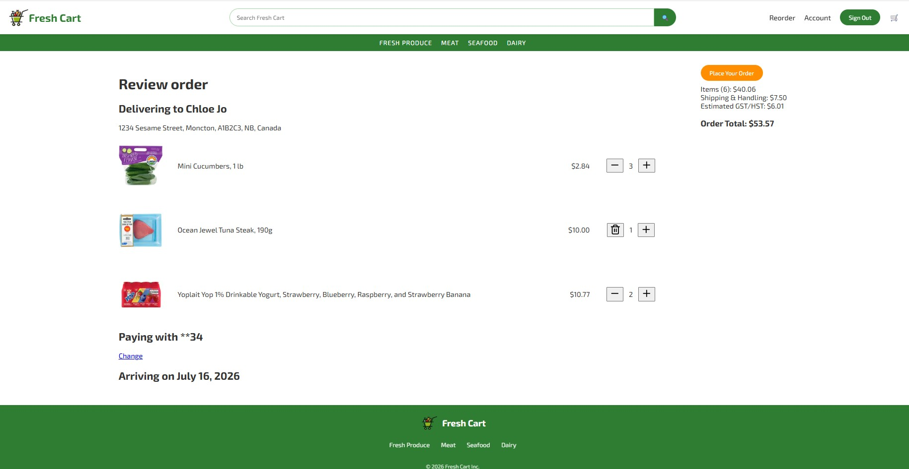

# Fresh Cart

A full-stack grocery e-commerce application built with Next.js, TypeScript, and MySQL.

---

## 📺 Live Demo

[Fresh Cart](https://fresh-cart-v2-eta.vercel.app/)

---

## 🎯 Problem

Online grocery shoppers expect a seamless experience across devices, including product search, cart management, and checkout. Maintaining cart data across authentication states and providing a responsive user experience are also important challenges for modern e-commerce applications.

---

## 💡 Solution

Fresh Cart is a full-stack grocery e-commerce application built with Next.js and MySQL. It provides product browsing, search, authentication, cart management, address management, and checkout functionality while focusing on responsive design and a seamless user experience.

---

## 🛠 Tech Stack

- Frontend: TypeScript, React, Next.js
- Backend: Next.js Route Handlers (REST API)
- Database: MySQL
- Deployment: Vercel, Railway

---

## 🚀 Features

- Browse products by category and view product details
- Search products and view search results
- Add products to the cart and complete checkout
- Merge guest cart items after sign-in
- Sign up and sign in securely
- Add and manage shipping addresses

---

## 📸 Screenshots

### Main Page



### Product List



### Product Detail



### Search & Search Results





### Cart



### Checkout



---

## 📈 Challenges & Solutions

### Preserving Guest Cart Items

**Problem:**
Guest cart items are lost when users sign in because guest and authenticated carts are managed separately.

**Solution:**
Store guest cart items in localStorage and merge them with the user’s cart after sign-in, allowing users to continue shopping seamlessly.

---

### Preventing Open Redirects

**Problem:**
Using unvalidated redirect URLs can expose users to phishing attacks and credential theft.

**Solution:**
Implement a redirect map and allow navigation only to predefined routes.

---

### Handling Failed Order Requests

**Problem:**
The "Placing Order..." button remains disabled when order creation fails, preventing users from retrying the checkout process.

**Solution:**
Add a finally block and reset the submitting state so that users can retry the checkout process after a failed order request.

---

## 🔮 Future Improvements

- Redesign the Account Dashboard with a card-based layout
- Implement an Order Details page
- Add Reorder, Payment Processing, and Buy Now functionality

---

## 📦 Installation / Setup

1. Clone the repository.

```bash
git clone https://github.com/chloejo-dev/fresh-cart-v2.git
```

2. Navigate to the project directory.

```bash
cd fresh-cart-v2
```

3. Install dependencies.

```bash
npm install
```

4. Create a `.env.local` file and add the required environment variables.

```env
DB_HOST=
DB_PORT=
DB_USER=
DB_PASSWORD=
DB_NAME=
JWT_SECRET=
```

5. Start the development server.

```bash
npm run dev
```

6. Open your browser and visit:

```text
http://localhost:3000
```

---

## 👤 Author

Chloe Jo
GitHub: [chloejo-dev](https://github.com/chloejo-dev)
